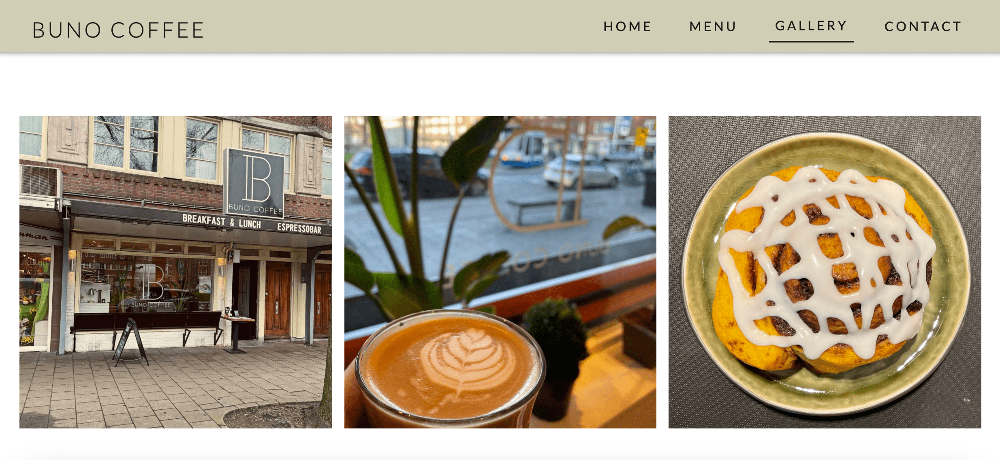
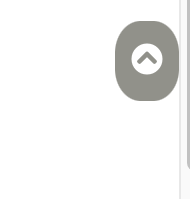

# Buno Coffee Website

[Buno Coffee Website In Action](https://yasi92.github.io/Buno-coffee-project/)

This is a website for Buno Coffee Amsterdam. A brand new cafe in the south of Amsterdam run by my partner and me.
The purpose of creating this website is twofold, educational and commercial.
From a commercial point of view, this website is intendend to provide visitors with basic and essential information about the shop spiced up with some relevant eye-catching images.   
This website has 3 linked pages and an internal linked section that categorize relevant material. Here the user will get to know various information starting from the products and quality, menu and prices, opening hours and location, and moreover, their attention will be drawn to some eye-catching and enticing images.   
Later, the page will be linked to the Google.map and redirects the visitors to the website.
The website is aimed at existing and potential customers, especially passers-by who have become aware of the new café but are not yet confident enough to enter the store. Visiting the site should encourage them to try it out and at the same time keep the existing customers up to date with any changes.

## UX

My goal to create this website is twofold, educational and commercial and I have tried to meet most expectations in both aspects.
Here I have tried to create a website with a minimal design requested by the client, yet keep it efficient and rich in terms of content and material.
### The business objectives of this website are:

- Build brand awareness.
- Provide visitors with basic and essential information about the store, such as product types, opening hours, and contact information.
- Convince visitors that this is a high-quality cafe.
- Convinve visitors to check out the menu card.
- Inform visitors about the types of services the business offers, such as hosting private events and gatherings.
- Grab visitors' attention with eye-catching and enticing images so that they will consider this place the next time they think of a good place to go out.    

###  The customer objectives of this website are:

- Looking for a quality, comfortable place for breakfast, lunch or daily coffee.
- Clear, easy to find prices.
- Looking for a place to hold special or private events.
- Searching for some pictures of the products the store offers.    

### The Ideal customer for this website is:

- English speaking
- Lives in Amsterdam specifically in the neighborhood.
- Is a fan of cafe and hospitality overall.    

### This project helps users achieve their goals when visiting the website by:

- Providing users with the intended type of information for which they visited the site.
- A good experience of UX.
- Easily navigating between pages and different parts of the site.
- Providing users with simple, understandable and categorized data.    

### User stories:

1. As a new visitor, I would like to get some general information and an introduction to the business.

2. As a new visitor, I would like to know about the menu items and the prices.

3. As a potential client, I would like to check out the gallery and see some photos of the place and the products.

4. As an interested visitor, I would like to know about the opening hours and get direction to the place.

5. As an interested visitor, I would like to know whether I can reserve the place for an event.

6. As a returning visitor, I would like to know about the latest updates in the store and the menu.

7. As a returning visitor, I would like to get in touch with the place and order in advance so that I can pick up my order at a specific time.

### wireframe mockups:
[Wireframes.pdf](wireframes/Wireframes.pdf)

1. Desktop

- [Home.pdf](wireframes/desktop/Desktop_Home.pdf)
- [Menu.pdf](wireframes/desktop/Desktop_Menu.pdf)
- [Gallery.pdf](wireframes/desktop/Desktop_Gallery.pdf)

2. Ipad

- [Home.pdf](wireframes/ipad/Ipad_Home.pdf)
- [Menu.pdf](wireframes/ipad/Ipad_Menu.pdf)
- [Gallery.pdf](wireframes/ipad/Ipad_Gallery.pdf)

 
3. Mobile 

- [Home.pdf](wireframes/mobile/Mobile_Home.pdf)
- [Menu.pdf](wireframes/mobile/Mobile_Menu.pdf)
- [Gallery.pdf](wireframes/mobile/Mobile_Gallery.pdf)
## Features

### Existing Features

* Design in Depth
     * The overall color theme of the website is inspired by the store's interior design, and an effort has been made to keep the color theme neutral yet warm and, slightly greenish.
     

     * The font families used in this project are:
          * Roboto for the body text and other elements.
          * Lato for the headlines and logo.
          * Sans-serif for the fallback font.

*  Navigation Bar     
    * Featured on all three pages, the full responsive navigation bar includes links to the Logo, Home page, Menu and Gallery page and is identical in each page to allow for easy navigation.
    * This section will allow the user to easily navigate from page to page across all devices without having to revert back to the previous page via the ‘back’ button.
    * The navigation bar collapses from medium screen sizes to a hamburger icon, which unfolds to a navigation drawer when clicked.
    * Clicking on the logo returns users to the home page as they would expect.

                        

* The landing page image and text     
    * The landing area, grabs the user's attention by scaling up the landing page image and giving a brief introduction about the business.
    * A small portion of the next section of the page is intentionally displayed to arouse the visitors' curiosity to scroll down.
    *  The two columns will be displayed in separate levels on Ipad and mobile devices for responsiveness reasons.

* The section "About our Products" 
     * The focus of this section is to convince visitors that this place has high quality and a wide variety of products.
     * The image of a bowl in this section is meant to catch the user's attention and arouse their curiosity.
     * The underlined menu link in this section provides an easy shortcut path to the menu page.
     * The two columns will be displayed in separate levels on Ipad and mobile devices for responsiveness reasons.
  
    

* The section "Our Cozy Place"
     * This section is intended to inform visitors about the space and the possibility of holding private or special events.
     * The images are displayed in a carousel container.
     * The two columns will be displayed in separate levels on Ipad and mobile devices for responsiveness reasons.

* The section "Gift card"     
     * This is the part where the user learns about the gift card service and also gets to see a module of the two sides of the gift card by simply sliding through the carousel container.
     * The two columns will be displayed in separate levels on Ipad and mobile devices for responsiveness reasons.

* The section "Opening Hours"
     * This area informs the user about the opening days and hours of the shop.   

* The section "contact information"    
     * This section provides users with the contact information of the cafe.
     * The corresponding icons are added to each of the contact paths, not only for design reaons, but also for a better UX experience and quick access.
     * Each of the contact links opens in a new tab to allow easy navigation for the user.
     * The Google map in this section is embeded for users to quickly and easily get directions to the location.
     * The two columns will be displayed in separate levels on Ipad and mobile devices for responsiveness reasons.

* The footer
     * Footer has been included in all three pages.
     * As the entire content of the page was originally created by the Bunocoffee team, the copyright is included in the footer to protect the copyright.

* Menu page 
   * The menu page lists the product names, prices, and an expansion of the ingredients of each item.
   * Each table will be displayed on a separate level on Ipad and mobile devices for responsiveness reasons.

* Gallery page
    * The gallery is an important part of the website, as it is meant to draw users' attention to the place and the products.
    * Each image in the gallery can be enlarged by clicking on it and is then automatically displayed in a carousel container in sequence.
    * Every image will be displayed on a separate level on mobile devices for responsiveness reasons.

* Sticky back-to-top button
    * After 1000 px of scrolling the page down, a sticky back-to-top button appears at the bottom right of the window to easily navigate to the top page without having to scroll all the way back up.
    * This feature is especially useful on mobile devices, as it prevents the user from having to scroll all the way back to the top of the page.

  ### Yet To Be Implemented

  - Another section to collect feedbacks.
  - Implementing online ordering system.

## Technologies Used

### Languages
- HTML5
- CSS3
- JavaScript

### IDE
- VScode

### Frameworks, Libraries, CDN's, resources:

1. [Hover.CSS](http://ianlunn.github.io/Hover/) 
- This was used for the navigation bar items and menu link.
2. [Animate.css](https://animate.style/) - 
- This was used for the animation effect on the headings.
3. [Bootstrapv4.5.3](https://getbootstrap.com/) - 
- This was used for the main layout of the 3 pages and modal gallery.
4. [w3schools](https://www.w3schools/) - 
- This was used for documentaion for most troubles and errors.
5. [CSS-TRICKS](https://css-tricks.com/) - 
- This was used for the carousel containers.
6. [Animista.net](https://animista.net/) - 
- This was used for the animation effect on the landing page image.
7. [Balsamiq](https://balsamiq.com/wireframes/) - 
- This was used to create the mockups during the design process.
8. [GitHub](https://github.com/) - 
- Github was used as remote repository and to deploy the website.
9. [Git](https://git-scm.com/) - 
- Git was used as version control to keep track of files and push them to the remote repository.
10. [FontAwesome](https://fontawesome.com/start) - 
- Font Awesome was used throughout the website to add icons.
11. [Google Fonts](https://fonts.google.com/) - 
- Google fonts were used to import the font styles in the website.
12. [Chrome Developer Tools:](https://developer.chrome.com/docs/devtools/) - 
- This was used for debugging and for checking the reponsiveness of the website.
13. [Ami Responsive](http://ami.responsivedesign.is/) - 
- This was used to test the website responsiveness.
14. [HTMLValidationService](https://validator.w3.org/) - 
- This was used to check the markup validity of the web documents.
15. [HTMLFormatter](https://www.freeformatter.com/html-formatter.html) - 
- This was used to check and fix the indentations.
16. [CSSValidationService](https://validator.w3.org/) - 
- This was used to check the markup validity of the web documents.
17. [compressor.io/](https://compressor.io/) - 
- This was used to compress the used images in the website.
18. [https://mycolor.space/](https://mycolor.space/) - 
- This was used to choose the color theme used in the website.
19. [Unicorn Revealer Extention](https://chrome.google.com/webstore/detail/unicorn-revealer/lmlkphhdlngaicolpmaakfmhplagoaln?hl=en-GB)
- This is a developer friendly tool to locate the overflows and was used throughout the process.
## Testing
Testing information can be found in a separate [TESTING.md file](/TESTING.md)
## Deployment

### Github
1. Log into Github and locate the relevant repository.
2. Click on the settings buttons on the menu.
3. Scroll down to the "Github pages".
4. Click on the link "Check it out here".
5. Change the branch from "none" to "main/master".
6. Click on the "save" button.
7. It might take a couple of minutes to retrieve the link to the published website in a green box.
8. Add the link of the website to the "About" section of the repository and include a short description to your project.
9. Click "Save Changes" and the link will be availbale in the About section of the repository.

### Local Clone
This is used to make changes to the project code.

1. log in to Github and locate the intended repository.
2. Open a new terminal on Git Bash.
3. Type git clone, and then paste the URL you copied from the remote repository.

`$ git clone https://github.com/Yasi92/Buno-coffee-project.git`

### Author 
I had initially started the project with a local username. I forgot to log in with my Github username for the author. Hence, my initial contributions were not counted by Github.

## Credits

- [Hover.CSS](http://ianlunn.github.io/Hover/)
- [Stackoverflow](https://stackoverflow.com/)
- [Animate.css](https://animate.style/)
- [Animista.net](https://animista.net/play/basic/scale-up)
- [CSS-TRICKS](https://css-tricks.com/creating-a-modal-image-gallery-with-bootstrap-components/)
- [w3schools](https://www.w3schools/howto/tryit.asp?filename=tryhow_js_scroll_to_top)
- [freeformatter](https://www.freeformatter.com/html-formatter.html)

## Content

- All content on this website have been created by myself and the Bunocoffee team.

## Media
- The photos used throughout the website have been taken by myself and the Bunocoffee team.

## Acknowledgements

- Tutors at Code Institute for their continued support.
- Code Institute's Slack community was a great help every step of the way during the project.
- My mentor Gurjot Singh.
- My web developer friend Monica Andreoli for her great feedback and help when I ran into problems.
- I have learned more in detail about how to complete my README from [Anna Gilhespy's project](https://github.com/AJGreaves/portrait-artist), provided in the Code Institute's Slack community as a README template.
 

