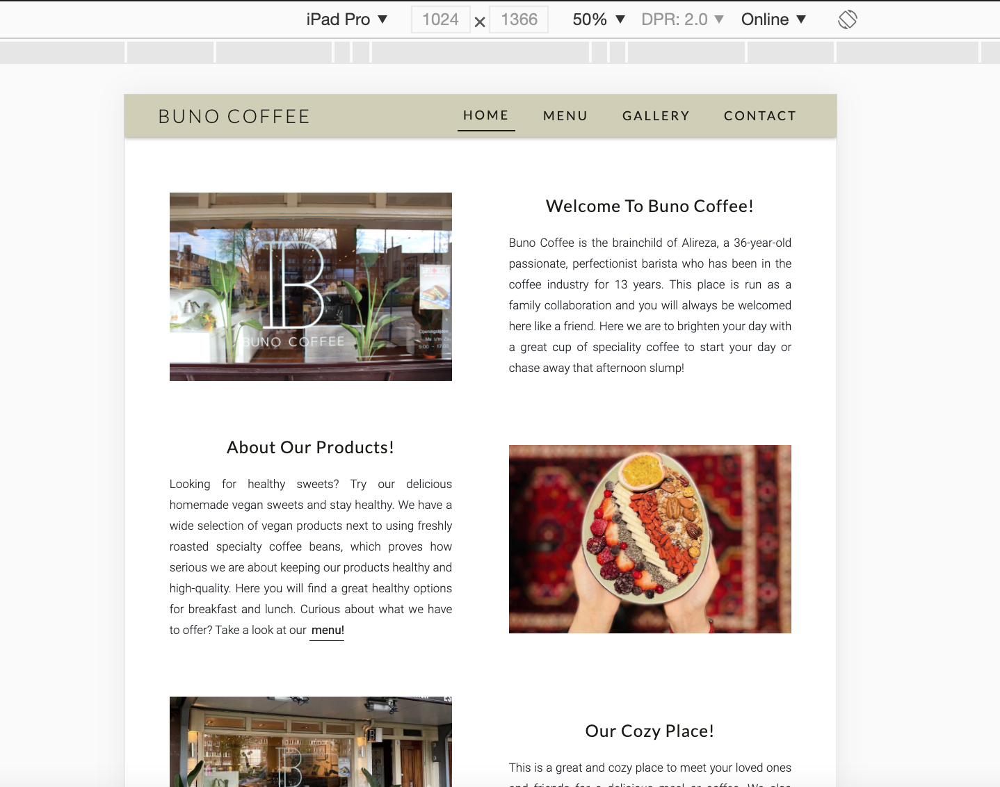

# Buno Coffee Website - Testing in detils

[Buno Coffee Website In Action]()            
[Main README.md file](README.md)

## Validation

- [W3C Markup Validation](https://validator.w3.org/#validate_by_uri) was used to validate the code in the three HTML files. I tested each page separately, debugged the errors and at the end, they have all passed with no errors.
- [W3C CSS Validation](https://jigsaw.w3.org/css-validator/#validate_by_uri) was used to validate the code in my style.css file.
- The website has been tested with the Lighthouse for each page separately and in both desktop and mobile devices and, required actions have been taken to improve the functionality of the website as much as possible and as far as related to HTML and CSS.

| Bugs | Solutions |
| ----------- | ----------- |
| When testing the published website, noticed that the "scroll-back-to-top" button does not appear after scrolling down the pages, while this was not an issue in the local repository. |  I have fixed this by placing the button in the top of the page, above all other elements.
| When testing the HTML files in the w3 validator, I received errors regarding bad values due to spaces in the "src" attributes of the images.| I have fixed these errors by renaming the images of the case. |
|When testing the HTML files in the w3 validator, I received errors regarding the presence of a button element in the head.  | I have fixed this by moving the button element to the body. |
| When testing the HTML files in the w3 validator, I received errors because of some obsolete attributes such as "frameborder", "scrolling", "marginheight" and, "marginwidth" in the iframe element. | I have fixed this issue by removing them from the html file and compensating the desired effect with CSS. |
| When testing the HTML files in the w3 validator, I received errors regarding the double presence of a single ID in the same HTML file and that happened to be the reason for the carousel box not functioning appropriately. The issue was using the same ID for two different elements. | I have fixed this by giving a unique ID name to the elements. |
| I have received a warning from the lighthouse feature asking to consider a title for the iframe element as screen reader users rely on frame titles to describe the contents of frames. | A title has been added to the element. |
|  I have received a warning from the lighthouse feature asking to consider using a "rel=noopener" attribute for any external links to improve performance and prevent security vulnerabilities.| The intended attribute has been added to all external links. |
| I have received a warning from the lighthouse feature asking to consider using meta element with unique descriptions and keywords in every page to optimize the search engine machine | This element has been added to every page separately |

             
## Unfixed Bugs
- In CSS validator, I have got a number of warnings caused by browser compatibility issues that I have left unfixed.
- In Markup Validation Service, I have disregarded 1 warning regarding considering using h2-h6 elements in the main section in each page, since the heading elements were put separately in the child elements inside each section for semantic reasons and not directly in the section area.

## Known issues
- In the "About our products" section, the two columns won't line up in iPad Pro and similar-size devices. I know that the overflow of the text area occurs due to the large text area, but due to the importance of the content, I prefer to keep the same amount of text.
In fact, the importance of content has surpassed the importance of ideal design.

## Client stories testing:

The potential common paths through the website:

- Home > Menu > Contact
- Home > Menu > Gallery
- Home > Gallery
- Home > Gallery > Contact
- Home > Contact

Each of these possible paths are acheivable by simply navigationg through the navigation bar and a menu link shortcut in the home page.

### Testing client stories from UX section of README.md

1. As a new visitor, I would like to get some general information and an introduction to the business.

      * No matter what page the user lands on, they can navigate to the home page and achieve their goal.

2. As a new visitor, I would like to know about the menu items and the prices.
     I. The user lands on the home page and can navigate to the menu page by clicking on the menu link from the navigation bar or by the menu link shortcut in the "About our products" section in the home page.
     II. The user lands directly on the menu page.
     III. The user lands on the gallery page and navigate to the menu page through the navigation bar.

3. As a potential customer, I would like to check out the gallery and see some photos of the place and the products.
     I. The user lands on the home page and can navigate to the gallery page by clicking on the gallery link from the navigation bar.
     II. The user lands on the menu page and can navigate to the gallery page by clicking on the gallery link from the navigation bar.
     III. The user lands directly on the gallery page.

4. As an interested visitor, I would like to know about the opening hours and get directions to the place.
     I. The user lands on the home page and after scrolling down the home page they will see the opening hours and contact info section.
     II. The user lands on the menu page and can navigate either to the contact section on the home page by clicking on the contact link from the navigation bar, or navigate to the home page and scroll down the page to reach the intended section.
     III. The user lands on the gallery page and can either navigate to the contact section on the home page by clicking on the contact link from the navigation bar or navigate to the home page and scroll down the page to reach the intended section.

5. As an interested visitor, I would like to know whether I can reserve the site for an event.
     I. The user lands on the home page and after scrolling down the home page they will find their expected information about booking the place and contact information.
     II. The user lands on the menu page and can navigate to the home page by clicking on the home link from the navigation bar and after scrolling down the home page they will find their intended information about reserving the place and contact information.
     III. The user lands on the gallery page and can navigate to the home page by clicking on the home link from the navigation bar and after scrolling down the home page they will find their intended information about reserving the place and contact information.

6. As a returning visitor, I would like to know about the latest updates in the store and the menu.
     I. The user lands on the home page and finds the latest changes corresponding to each section on the home page.
     II. The user lands on the menu page and finds all the updates on the menu card.
     III. The user lands on the gallery page and find the latest photos of the products and place.
     IV. No matter what page the user lands on they can always navigate to the intended page through the navigation bar on the top of every page.

7. As a returning visitor, I would like to get in touch with the place and order in advance so that I can pick up my order at a specific time.
    I. No matter what page the user lands on, they can click on the contact link from the navigation bar and, click on the telephone icon.
     